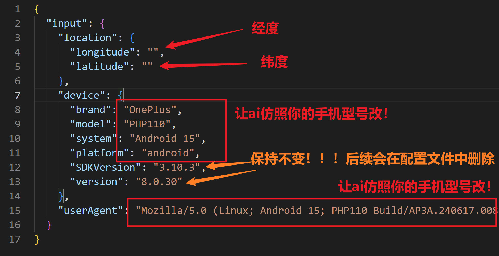
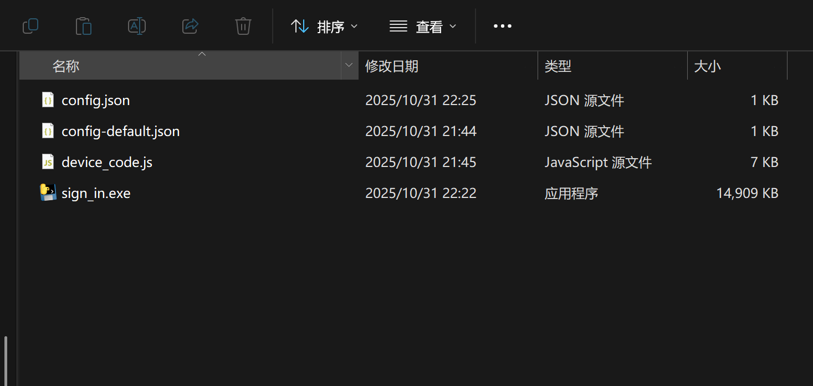
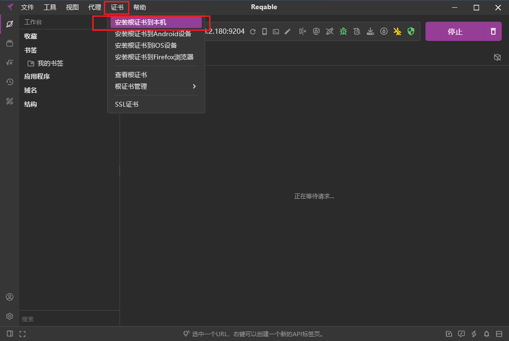
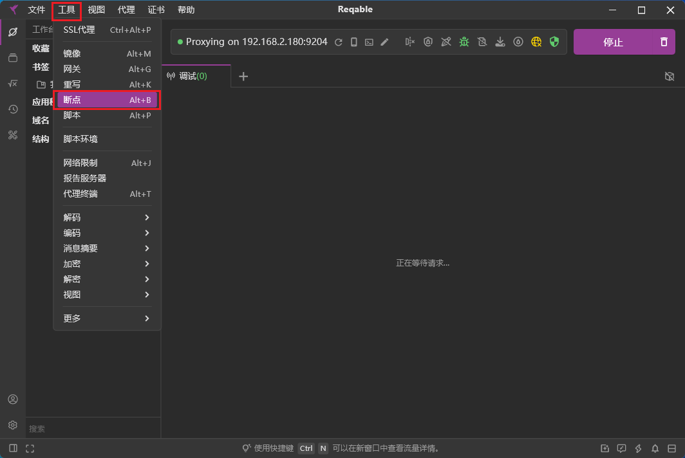
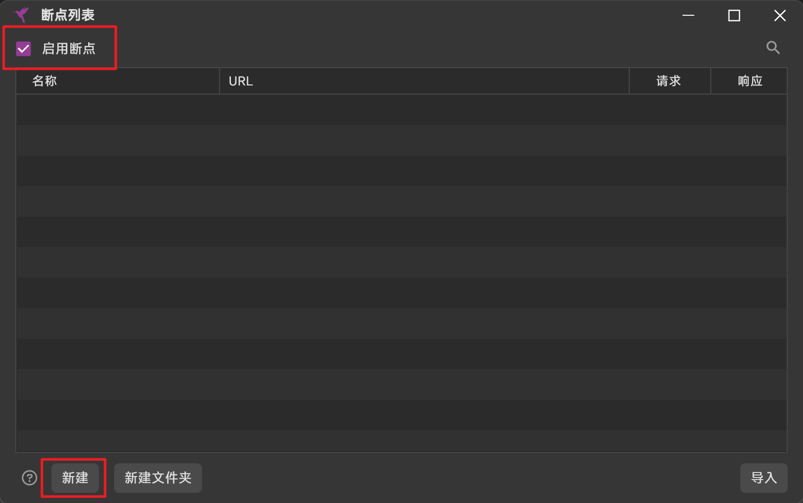
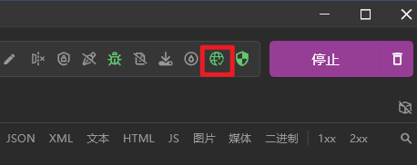
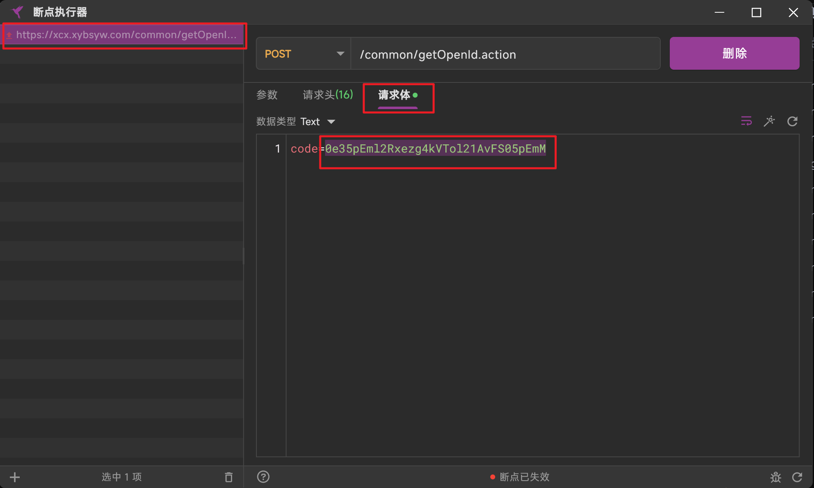
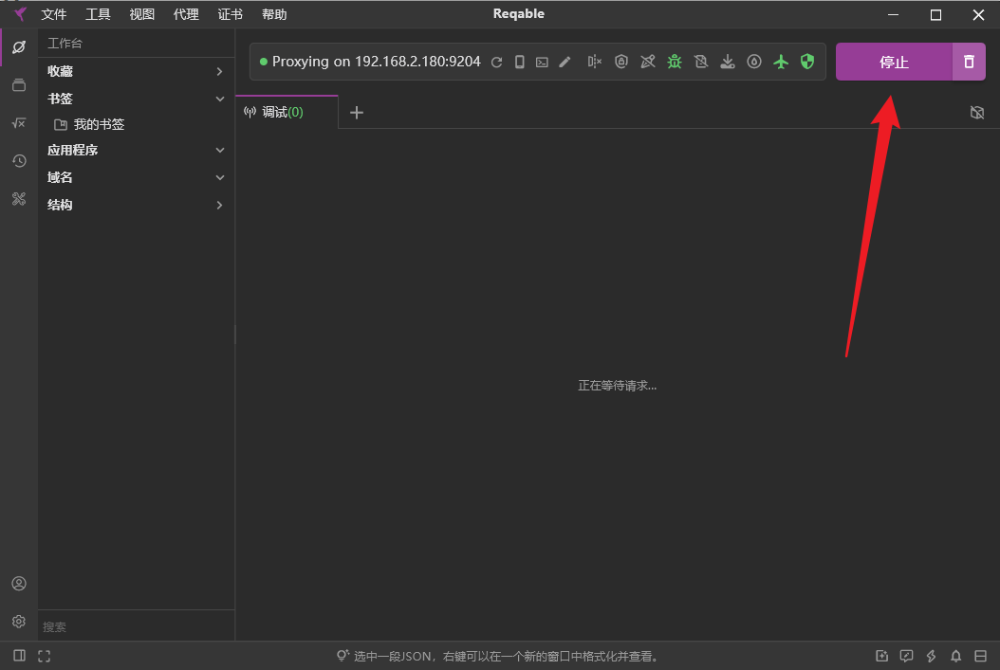
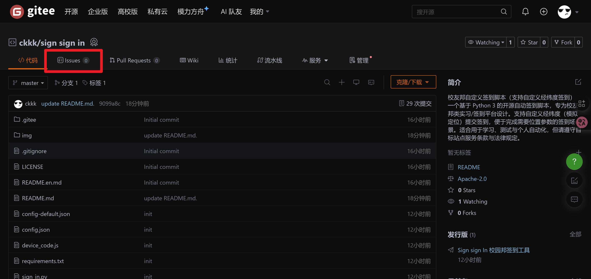

# 校友邦签到自动化项目（仅用于个人学习用途！！！仅用于个人学习用途！！！仅用于个人学习用途！！！）
### 若对您有帮助，可以为项目star，以获取最新版本。
### 如有学习问题可进入交流群：859098272

## 介绍

这是一个基于 Python 3 的开源自动化签到项目，专为校友邦类实习/签到平台设计。适用于需要自动化签到场景。该脚本适合用于学习、测试与个人自动化，不涉及任何商业、违法违规用途，且遵守相关服务条款与法律规定。

## 软件架构

本项目采用 Python 3 编写，主要功能包括配置读取、网络请求、设备模拟和签到逻辑。核心模块包括：

- 配置管理：读取和保存签到所需的配置信息。
- 网络请求：处理登录、获取签到计划、提交签到等网络操作。
- 设备模拟：自动生成设备信息。
- 签到逻辑：根据配置信息自动完成签到流程。

## 🙏 特别鸣谢

感谢所有对本项目提供支持和帮助的朋友们，你们的赞助不仅是物质上的支持，更是对我持续创作、优化与维护开源项目的巨大鼓励。

💖 特别感谢以下赞助者（排名不分先后）：

- 弓长🐧
- 86
- Neon
- 一杯疏狂
- 坏孩子
- 椰汁糕
- 惠惠
- 君度

感谢你们的信任与支持，让我能够坚持投入更多时间与精力，带来更稳定实用的功能、更优雅的代码和更详细的文档。

## 使用教程 之 新版软件启动方式（v1.0.4及以上）

1. 进入下载页面：[点我下载最新版本](https://gitee.com/ckkk524334/sign-sign-in/releases/latest)：

   
​

2. 解压下载的压缩包。


3. 修改配置文件 config.json，如果不知道怎么获取经纬度，推荐网站 👉 https://api.map.baidu.com/lbsapi/getpoint/



4. 双击 sign_in.exe 运行即可。


## 使用教程 之 旧版软件启动方式 （注意，本节为旧版v1.0.3及以下版本教程！）

1. 进入下载页面：[点我下载最新版本](https://gitee.com/ckkk524334/sign-sign-in/releases)：


​

2. 解压下载的压缩包：



​

3. 下载并安装 Reqable 抓包工具，官方链接：[https://reqable.com/zh-CN/](https://reqable.com/zh-CN/)。
   也可从本仓库下载：[reqable](https://gitee.com/ckkk524334/sign-sign-in/raw/master/software/reqable-app-windows-x86_64.exe/)
​

4. 打开刚刚安装的 Reqable 抓包工具并安装证书，点击“证书-安装根证书到本机”安装证书：




5. 点击 “工具 -- 断点” ：



​

6. 勾选左上角 “启动断点” 按钮，并点击左下角 “新建”：



​

7. “名称” 填写：
    ```bash
    getOpenId.action
    ```
   “URL” 填写：
    ```bash
    https://xcx.xybsyw.com/common/getOpenId.action
    ```

   点击 “完成” ：

   

   ​

8. 返回主页面，点击 “启动” 开始抓包：


​

9. 进入校友邦小程序，观察 Reqable 抓包工具是否有信息，是否自动弹出 “断点执行器” 页面:


​

10. 若没有自动弹出 “断点执行器” 页面，则可尝试点击“代理-系统代理”开启系统代理，或点击 “代理 -- 二级代理” 开启二级代理，让
    “地球图标” 或 ”飞机图标“ 为绿色即为成功开启：




​

11. 若自动弹出 “断点执行器” 页面，则可点击请求体，复制 “code=” 后面的一长串（注意不要包含 “code=” ）:



​

12. 若成功抓取到code，请复制后点击 “停止” 抓取，否则会拦截脚本的请求！！！！
    若成功抓取到code，请复制后点击 “停止” 抓取，否则会拦截脚本的请求！！！！
    若成功抓取到code，请复制后点击 “停止” 抓取，否则会拦截脚本的请求！！！！
    若成功抓取到code，请复制后点击 “停止” 抓取，否则会拦截脚本的请求！！！！



13. 使用记事本或其他文本编辑软件打开刚才解压出来的 config.json 文件:


​

14. 将刚才复制的 code 填入 code 对应后方的双引号中:


15. 根据下图填写其他信息，别忘了保存，别忘了保存，别忘了保存！！！


16. 双击运行 sign_in.exe，根据控制台日志修改:


使用教程至此结束！

若有任何疑问，请前往 issues 并携带日志或报错截图提问：



## 使用教程 之 源码启动方式（非开发者可忽略）

1. 安装 Python 3.x（推荐使用 Python 3.6 或更高版本）。

2. 克隆本仓库到本地：
   ```bash
   git clone https://gitee.com/ckkk524334/sign-sign-in.git
   ```

3. 安装依赖库：
   ```bash
   pip install -r requirements.txt
   ```

4. 抓包和配置文件同上。

## 参与贡献

1. Fork 本仓库。
2. 创建新的功能分支（如 `feat-signin`）。
3. 提交您的代码改进或新增功能。
4. 创建 Pull Request，等待审核与合并。

## 请我喝瓶冰露

开发不易，若能您对您有帮助，是我们的荣幸，若您手头有余，在自己有可乐喝的前提下，可以考虑请我喝瓶冰露：


本项目为学习与技术研究用途而开发，旨在帮助开发者了解 自动化流程、HTTP 请求分析、网络代理、脚本化任务调度 等相关技术。
任何使用本项目进行非授权访问、数据抓取、批量刷任务、破坏系统、商业运营等行为均与本项目作者无关。

## 免责声明

✅ 使用者须知

本项目仅限个人学习交流使用。使用者需确保操作账号、设备、数据等均为本人合法所有。使用过程中需遵守目标平台的《用户协议》《服务条款》及相关法律法规。禁止将本项目用于：批量刷任务或冒用他人身份、逆向商业系统、绕过付费机制、突破权限验证、传播或收集他人隐私信息、账号数据、运营“代刷”“自动托管”类付费服务


✅ 免责声明

本项目不对使用本脚本导致的任何账号异常（包括但不限于封禁、风控、任务失败、信息缺失等）承担责任。使用本项目产生的一切后果（包含法律、账号、数据等风险）由使用者自行承担。如因使用本项目违反相关平台协议、法律法规或造成损失，责任由使用者承担。使用者视为已阅读并同意上述内容。


## 许可证

本项目遵循 MIT 许可证，请在使用时遵守相关条款。