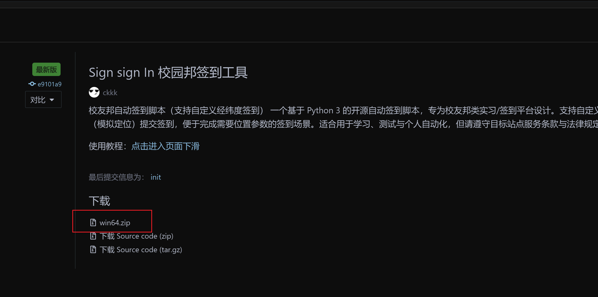
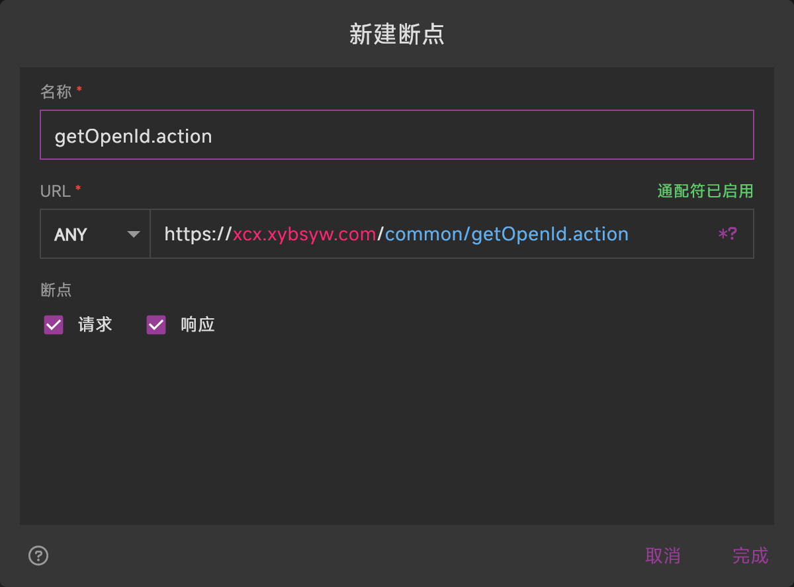
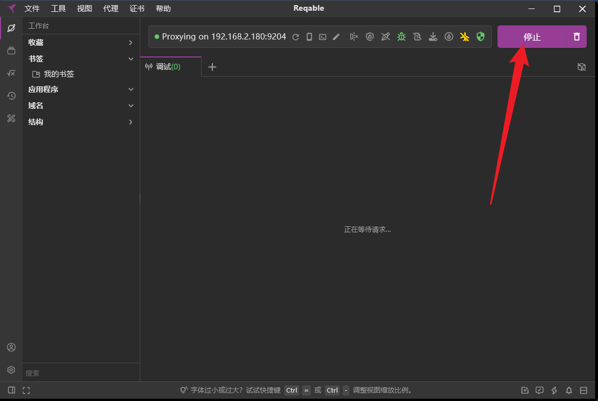
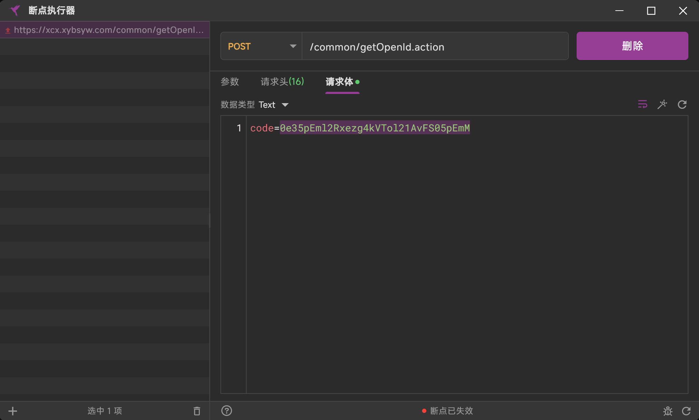
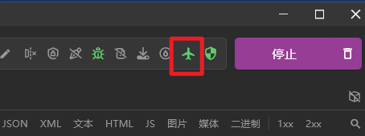
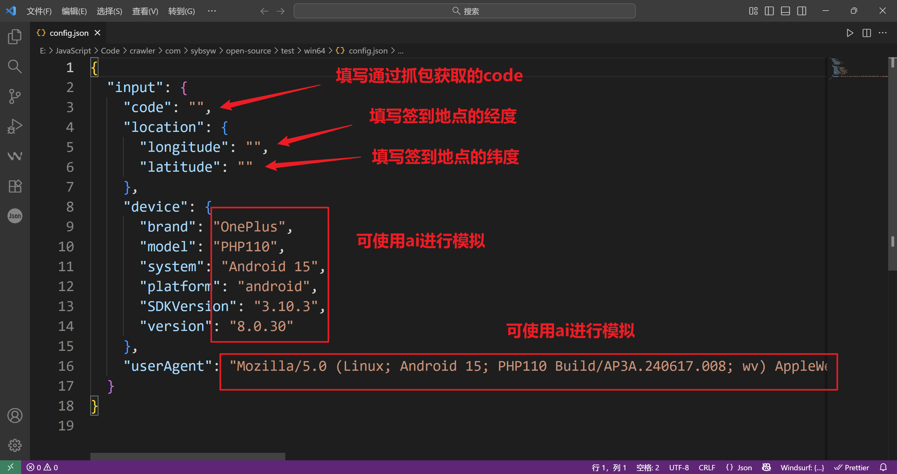
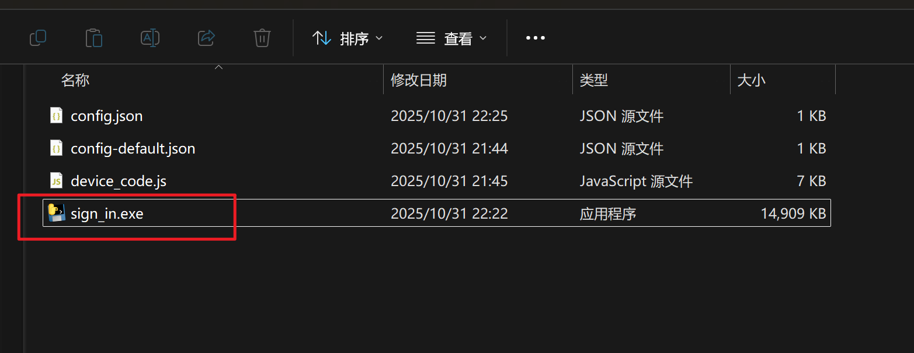

# 校友邦自定义签到脚本

## 介绍
这是一个基于 Python 3 的开源自动签到脚本，专为校友邦类实习/签到平台设计。它支持自定义经纬度（模拟定位）提交签到，适用于需要位置参数的签到场景。该脚本适合用于学习、测试与个人自动化，但请务必遵守目标站点的服务条款与法律规定。

## 软件架构
本项目采用 Python 3 编写，主要功能包括配置读取、网络请求、设备模拟和签到逻辑。核心模块包括：
- 配置管理：读取和保存签到所需的配置信息。
- 网络请求：处理登录、获取签到计划、提交签到等网络操作。
- 设备模拟：生成模拟设备信息，用于伪装设备指纹。
- 签到逻辑：根据配置信息自动完成签到流程。

## 安装教程 之 软件启动方式
1. 点击进入下载页面：[https://gitee.com/ckkk524334/sign-sign-in/releases](https://gitee.com/ckkk524334/sign-sign-in/releases)：


2. 解压下载的压缩包：


3. 下载并安装Reqable抓包工具，官方链接：[https://reqable.com/zh-CN/](https://reqable.com/zh-CN/)。

4. 打开刚刚安装的Reqable抓包工具并安装证书，点击“证书-安装根证书到本机”安装证书：


5. 点击“工具-断点”：


6. 勾选左上角按钮，并点击左下角新建：


7. 名称填写：
    ```bash
    getOpenId.action
    ```
    URL填写：
    ```bash
    https://xcx.xybsyw.com/common/getOpenId.action
    ```
    点击完成：


8. 返回主页面，点击“启动”开始抓包：


9. 进入校友邦小程序，观察Reqable抓包工具是否有信息，是否自动弹出“断点执行器”页面:


10. 若没有自动弹出“断点执行器”页面，则可尝试点击“代理-系统代理”开启系统代理，或点击“代理-二级代理”开启二级代理，让地球图标或飞机图标为绿色即为成功开启：



11. 若自动弹出“断点执行器”页面，则可点击请求体，复制“code=”后面的一长串（注意不要包含“code=”）:


12. 使用记事本或其他文本编辑软件打开刚才解压出来的config.json文件:


13. 将刚才复制的code填入code对应后方的双引号中:


14. 根据下图填写其他信息，别忘了保存，别忘了保存，别忘了保存！！！


15. 双击sign_in.exe，根据控制台日志修改:



## 安装教程 之 源码启动方式
1. 安装 Python 3.x（推荐使用 Python 3.6 或更高版本）。
2. 克隆本仓库到本地：
   ```bash
   git clone https://gitee.com/ckkk524334/sign-sign-in.git
   ```
3. 安装依赖库：
   ```bash
   pip install -r requirements.txt
   ```
4. 抓包和配置文件同上。

## 参与贡献
1. Fork 本仓库。
2. 创建新的功能分支（如 `feat-signin`）。
3. 提交您的代码改进或新增功能。
4. 创建 Pull Request，等待审核与合并。

## 特技
1. 使用多语言 `Readme_XXX.md` 文件支持国际化，如 `Readme_en.md` 和 `Readme_zh.md`。
2. 了解更多 Gitee 相关资源：
   - Gitee 官方博客: [blog.gitee.com](https://blog.gitee.com)
   - Gitee 探索页面: [https://gitee.com/explore](https://gitee.com/explore)
   - GVP（Gitee 最有价值开源项目）: [https://gitee.com/gvp](https://gitee.com/gvp)
   - Gitee 封面人物: [https://gitee.com/gitee-stars/](https://gitee.com/gitee-stars/)
3. Gitee 官方使用手册: [https://gitee.com/help](https://gitee.com/help)

## 开发不易，若能您对您有帮助，是我们的荣幸，若您手头有余，在自己有可乐喝的前提下，可以考虑请我喝瓶冰露：


## 许可证
本项目遵循 MIT 许可证，请在使用时遵守相关条款。